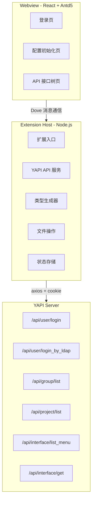
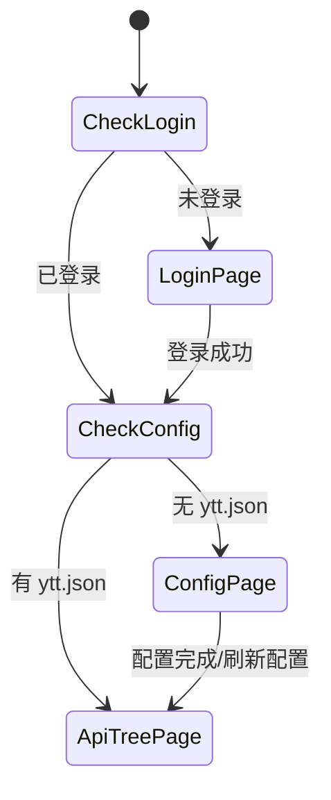

# yapi2code VSCode 插件开发计划

## 整体架构



## 项目结构

```
yapi2code/
├── package.json                # 扩展清单 + 依赖
├── tsconfig.json               # Extension TS 配置
├── vite.config.ext.ts          # Extension 构建（target: node）
├── vite.config.webview.ts      # Webview 构建（target: browser）
├── src/
│   ├── extension.ts            # activate/deactivate 入口
│   ├── webview/
│   │   ├── WebviewProvider.ts  # WebviewViewProvider 实现
│   │   └── getHtml.ts          # Webview HTML 模板
│   ├── services/
│   │   ├── yapiApi.ts          # YAPI API 封装（登录/分组/项目/接口）
│   │   └── request.ts          # axios 封装（cookie 管理 + 自动重登录）
│   ├── core/
│   │   ├── messageHandler.ts   # Extension 侧消息处理
│   │   └── typeGenerator.ts    # YAPI 数据 → TS 类型/request 函数
│   ├── utils/
│   │   ├── dove.ts             # 消息通信层（request-response 模式）
│   │   └── storage.ts          # globalState 封装
│   └── constants/
│       ├── msgType.ts          # 消息类型枚举
│       └── config.ts           # 默认配置/常量
├── webview/                    # React 前端（独立构建）
│   ├── src/
│   │   ├── main.tsx            # React 入口
│   │   ├── App.tsx             # 根组件（页面路由状态机）
│   │   ├── utils/
│   │   │   └── dove.ts         # Webview 端 Dove 实例
│   │   └── pages/
│   │       ├── Login/
│   │       │   ├── index.tsx   # 登录页（LDAP + 默认登录）
│   │       │   └── index.less
│   │       ├── Config/
│   │       │   ├── index.tsx   # 配置初始化页（三步引导）
│   │       │   └── index.less
│   │       └── ApiTree/
│   │           ├── index.tsx   # API 树主组件
│   │           ├── MethodTag.tsx # HTTP 方法标签
│   │           └── index.less
│   ├── index.html
│   └── tsconfig.json
└── dist/                       # 构建产物
    ├── extension.js
    └── webview/
        ├── main.js
        └── main.css
```

## 核心模块设计

### 1. 消息通信层（Dove）

Extension 和 Webview 之间通过 `postMessage` 通信，Dove 封装为带 UUID 匹配的 request-response 模式：

```typescript
// 发送消息并等待响应
const result = await dove.sendMessage(MsgType.FETCH_DETAIL, { id: 123 });

// 订阅消息并处理
dove.subscribe(MsgType.LOGIN_NOW, async (data) => {
  const result = await yapiApi.login(data);
  return result; // 自动回传给调用方
});
```

### 2. YAPI API 服务

使用 axios 封装，核心端点：

| 端点                                          | 用途        |
| ------------------------------------------- | --------- |
| POST `/api/user/login`                      | 默认登录      |
| POST `/api/user/login_by_ldap`              | LDAP 登录   |
| GET `/api/group/list`                       | 获取分组列表    |
| GET `/api/project/list?group_id=x`          | 获取项目列表    |
| GET `/api/interface/list_menu?project_id=x` | 获取接口分类+接口 |
| GET `/api/interface/get?id=x`               | 获取接口详情    |

Cookie 管理：从响应头 `set-cookie` 提取并存储到 globalState，后续请求自动携带。

### 3. TypeScript 类型生成器

将 YAPI 接口详情的 JSON Schema 转换为 TS 代码：

- **请求参数类型**：从 `req_query`（GET 参数）和 `req_body_other`（POST body）生成 interface
- **响应体类型**：从 `res_body`（JSON Schema）递归生成 interface
- **request 函数**：根据 method/path 生成函数名，拼接 import + 函数体 + 类型标注

输出示例：

```typescript
export interface IGetUserDetailReqQuery {
  id: string;
}

export interface IGetUserDetailResData {
  name: string;
  age: number;
  roles: string[];
}

export async function getUserDetail(params: IGetUserDetailReqQuery): Promise<IGetUserDetailResData> {
  return request.get('/api/user/detail', { params });
}
```

### 4. 三个 Webview 页面

**页面状态机**：



**登录页**：
- 服务器地址输入框（支持自定义 YAPI 地址）
- 用户名/密码输入
- LDAP / 默认登录 切换开关
- 记住上次登录信息

**配置初始化页**（参考截图）：
- 步骤 1：自动创建 ytt.json 按钮 + 示例代码展示
- 步骤 2：引导前往 YAPI 平台复制 projectId 和 token
- 步骤 3：刷新配置按钮

**API 接口树页**：
- 顶部搜索栏（按接口名/路径过滤）
- 树形结构：项目 → 分类 → 接口（按需懒加载）
- 接口节点显示 HTTP 方法标签（GET/POST/PUT/DELETE 不同颜色）+ 接口名
- 右键菜单：生成类型到文件 / 复制到剪贴板 / 插入到光标位置 / 在 YAPI 中打开

### 5. ytt.json 配置文件

```json
[
  {
    "projectId": 8655,
    "token": "c766bcbc3f8f31ae57701c9a46311a..."
  }
]
```

Extension 监听 `ytt.json` 的保存事件，变更后自动刷新 Webview 数据。

### 6. 构建配置

使用两套 Vite 配置分别构建：

- **Extension**（`vite.config.ext.ts`）：target node，输出 CommonJS，externals `vscode`
- **Webview**（`vite.config.webview.ts`）：target browser，输出 ESM，处理 React/Antd/Less

npm scripts：

```json
{
  "build": "npm run build:ext && npm run build:webview",
  "build:ext": "vite build --config vite.config.ext.ts",
  "build:webview": "vite build --config vite.config.webview.ts",
  "dev:webview": "vite --config vite.config.webview.ts"
}
```

### 7. 主要依赖

**Extension 侧**：`axios`、`vscode`（types）
**Webview 侧**：`react`、`react-dom`、`antd`（暗色主题）
**构建**：`vite`、`@vitejs/plugin-react`、`typescript`、`less`

## 使用方式

1. 进入项目目录：`cd yapi2code`
2. 安装依赖：`npm install`
3. 构建：`npm run build`
4. 按 F5 启动调试，在新打开的 VSCode 窗口侧边栏中看到 YAPI to Code 图标
